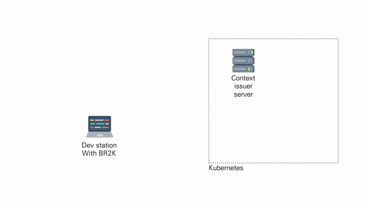

# About


<br><br>

# Live-Demo




<br><br>

# Directory structure

```bash
cd PROJECT
br2k init
ls
```

The generated br2k-project has the following directory structure

```
.
├── app.js
├── bin
│   └── www
├── package.json
├── public
│   ├── images
│   ├── javascripts
│   └── stylesheets
│       └── style.css
├── routes
│   ├── index.js
│   └── users.js
└── views
    ├── error.pug
    ├── index.pug
    └── layout.pug

7 directories, 9 files
```

<br/>

# Prerequires

- Install nodejs, npm
- Install <a href=https://www.docker.com/>Docker</a>
- Install <a href=https://trufflesuite.com>Truffle framework</a>
- Run <a href=#Terms>context-verifier-server </a>
- [12/04](#Terms)
- Build k8s cluster (ref. prerequire-br2k-cli)

<br/>

# Quick Start

`Install`

```bash
npm i -g br2k-cli
```

`br2k commands work only in the project root`

```bash
$ mkdir PROJECT_NAME
$ cd PROJECT_NAME
$ br2k init
$ br2k ask-context -f CONTEXT_ASK_FILE.yaml -r CONTEXT_ASSIGN_SERVER_URL
$ br2k set-context -f ./context.yaml
$ br2k list-context (or br2k cur-context)
$ (option) br2k add-image-registry -f REGISTRY_ACCOUNT_FILE.yaml (example ->DIR: specific-document-example)
$ (option) br2k add-service-registry -f SERVICE_ACCOUNT_FILE.yaml (example ->DIR: specific-document-example)
$ br2k build -n APP_NAME(option)   (Place your custom docker file PROJECT_ROOT/util/docker/ )
$ br2k list (Get BUILD_IMAGE_NAME or BUILD_IMAGE_ID )
$ br2k login-registry -p REGISTRY_PASSWORD (Cert ref -> docs.docker.com/engine.security/certificates/)
$ br2k push -i BUILD_IMAGE_NAME(or BUILD_IMAGE_ID) -p CONTAINER_REGISTRY_PROJECT
$ br2k set-secret -p PASSWORD_CONTAINER_REGISTRY
$ br2k register -f SERVICE_INFO.yaml -p ACCOUNT_PASSWORD
$ br2k view-service (or br2k view-service -f ./service-info.json)
$ br2k test -i IMAGE_NAME -s SECRET_NAME(option)
$ br2k test -e
$ br2k spray -i IMAGE_NAME -r REPLICAS -s SECRET(when step.13) -n APP_NAME
$ br2k state && br2k view-service
```

<br/>

# Prerequisites for internal configuration of kubernetes

- Labeling each worker node.
- In the case of a Barmetal environment, implement an network load-balance (ref. MetaLB project)

<br/>

# Terms

- context: A file containing information about Kubernetes resources used for service deployment
- context-verifier-server:

# Description of br2k-cli github folder

- example-framework:
- context-issuer-server: A server for issuing context files

# Modify Log

-[2020.12.03] change k8s client: kubernetes-client(3rd party module) => @kubernetes/client-node(officially library)

- spary add localDB yaml ->> yaml file Hash store --> Service Registry+ context.json

<br/>

# Dependencies

- node v14.15.1
- npm 6.14.8
- truffle 5.1.55 (install: npm install -g truffle)
- docker 19.03
