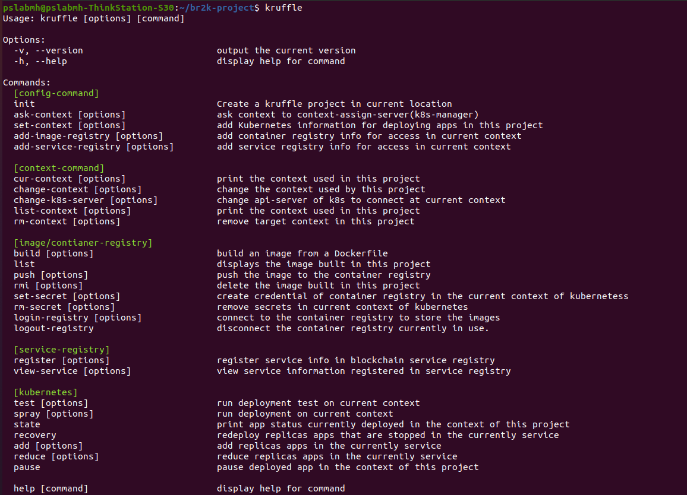

## Command line interface for BR2K framework




```
.
├── app.js
├── bin
│   └── www
├── package.json
├── public
│   ├── images
│   ├── javascripts
│   └── stylesheets
│       └── style.css
├── routes
│   ├── index.js
│   └── users.js
└── views
    ├── error.pug
    ├── index.pug
    └── layout.pug

7 directories, 9 files
```


## modify()
-[2020.12.03] change k8s client: kubernetes-client(3rd party module) => @kubernetes/client-node(officially library)
- spary add localDB yaml ->> yaml file Hash store --> Service Registry+ context.json

<br/>

## 구현 환경
- node v14.15.1
- npm 6.14.8
- truffle 5.1.55 (install: npm install -g truffle)
- docker 19.03

<br/>

## 실행 조건
- docker(HOST PC used br2k)
- context-verifier-server run
- k8s cluster 구축(detail: Reference prework-for_br2k-CLI folder)
- labeling k8s work-node

<br/>

## 설치
```
git clone PROJECT or npm i br2k-truffle
npm link(package.json의 bin에 의해서 전역 모듈)
```

<br/>

## Fast starting


`All br2k commands work only in the project root!`

```bash
$ mkdir PROJECT_NAME
$ cd PROJECT_NAME
$ br2k init
$ br2k ask-context -f CONTEXT_ASK_FILE.yaml -r CONTEXT_ASSIGN_SERVER_URL
$ br2k set-context -f ./context.yaml
$ br2k list-context (or br2k cur-context)
$ (option) br2k add-image-registry -f REGISTRY_ACCOUNT_FILE.yaml (example ->DIR: specific-document-example)
$ (option) br2k add-service-registry -f SERVICE_ACCOUNT_FILE.yaml (example ->DIR: specific-document-example)
$ br2k build -n APP_NAME(option)   (Place your custom docker file PROJECT_ROOT/util/docker/ )
$ br2k list (Get BUILD_IMAGE_NAME or BUILD_IMAGE_ID )
$ br2k login-registry -p REGISTRY_PASSWORD (Cert ref -> docs.docker.com/engine.security/certificates/)
$ br2k push -i BUILD_IMAGE_NAME(or BUILD_IMAGE_ID) -p CONTAINER_REGISTRY_PROJECT
$ br2k set-secret -p PASSWORD_CONTAINER_REGISTRY
$ br2k register -f SERVICE_INFO.yaml -p ACCOUNT_PASSWORD
$ br2k view-service (or br2k view-service -f ./service-info.json)
$ br2k test -i IMAGE_NAME -s SECRET_NAME(option)
$ br2k test -e
$ br2k spray -i IMAGE_NAME -r REPLICAS -s SECRET(when step.13) -n APP_NAME
$ br2k state && br2k view-service
```

<br/>

## 구현 및 관리 메모 사항
- 쿠버네티스 라인 인터페이스 모듈 버전 고정(kubernetes-client@7.0.1)-> 변경 시에 에러 발생 가능성 있음.

<br/>

## 쿠버네티스 관리자가 `context`(유저가 사용하는 리소스 명세파일) 생성 절차


#### context struct
- api-server: array
- access-token: string
- assign-resource: object
   - node-id: string(node label 값)
   - network-id: string(service 오브젝트를 생성할 때 명세해준 label 값을 의미)
   - service-protocol: string(http, https,...)
   - service-points: array(external ip )
   - service-port: 3000(`array로 수정 `)


#### 쿠버네티스 우선 설정해야하는 것들
- 사용할 쿠버네티스 클러스터에 kubectl 연결
- 쿠버네티스의 각 노드에 label 할당(./k8s-managers-example/add_node_labels/label.sh 실행)
- 온 프레미너스 쿠버네티스인 경우 service 오브젝트의 ip 자동할당을 위한 baremetal-lb 셋팅

#### context 생성
- 서비스 오브젝트들 생성(for 복제 앱의 외부 접근을 위하여, 그 유저의 할당량 만큼, ./k8s-managers-example/assign-service(external_ip).yaml 사용)
- 유저가 사용할 namespace 발급(쿠버네티스의 논리적 구역 단위)
- 유저가 사용할 서비스 계정(Service Account) 생성(서비스 계정의 액세스 토큰를 context에 사용, ./k8s-managers-example/assign_accessToken_to_user/access_token.sh 실행 ) 


<br/>

## 폴더 구조 메모


#### ``example-framework``

해당 framework를 사용한 3개의 예시 프로젝트


#### ``res``

br2k init할 때 사용되는 리소스들(init할 프로젝트에 파일 및 폴더 생성)

1. /res/util/regsitry: 블록체인 서비스 레지스트리 스마트 컨트랙트 ABI 파일 있는 곳
2. /res/util/k8s:
    - ``contexts.json``: br2k 프로젝트 핵심 명세파일
    - example: contexts.json 기록되는 예시가 담긴 폴더 
    - template: 서비스를 배포할 때 사용될 쿠버네티스 yaml 템플릿 파일(pod.yaml[core], secret 폴더[쿠버네티스 컨테이너 이미지 다운받을 때 사용되는 계정 정보:쿠버네티스 계정], test-pod.yaml[?])
    - command: ``?``
3. /res/util/docker:
    - image.json: 빌드된 이미지 기록된 파일
    - ``? `` registry.json: 빌드된 이미지가 컨테이너 레지스트리에 푸시할 때 기록하는 것
4. k8s-managers-exmaple: 쿠버네티스 관리자가 ``contexts.yaml``을 만들 때 필요한 스크립트와 파일들
5. /res/specific-document-example: br2k에서 사용되는 파일 양식 예제
    - context.yaml: 쿠베 관리자에 의해서 전달받은 context(사용할 수 있는 context 명세) 
    - context-ask.yaml: file for ask context to manager
    - registry-auth.yaml: (하버) 레지스트리 로그인 
    - service-registry-auth.yaml: 서비스 레지스트리 컨트랙트에 접근할 계정 정보
    - service-registry-content.yaml: 서비스 레지스트리에 서비스 정보를 넣을 때 명세해야하는 파일
6. /res/Dockerfile AND /res/.dockerignore
    - Dockerfile: 복제 앱을 컨테이너 이미지로 만들 때 사용되는 도커 이미지 빌드 파일
    - .dockerignore: 


<br/>


